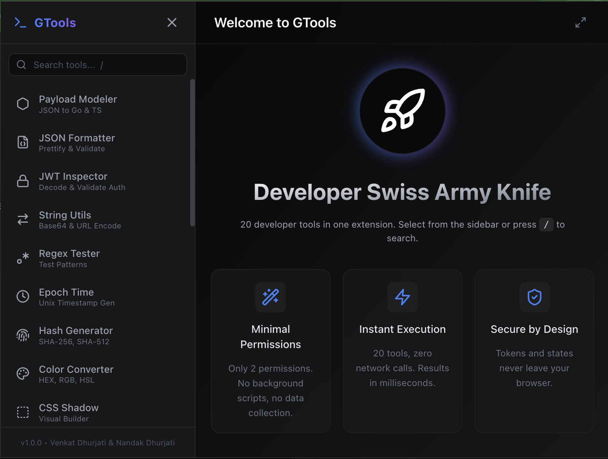

<p align="center">
  
</p>

<h1 align="center">GTools</h1>

<p align="center">
  <strong>20 developer tools. One click. Zero trust required.</strong>
</p>

<p align="center">
  <a href="LICENSE"></a>
  
  
  
  
  
</p>

---

<br/>

## The Problem

You're debugging a production issue at 2 AM. You copy a JWT from the response headers. You paste it into some random website to decode it.

That JWT contains your user's email, your internal service name, your company's tenant ID. You just sent it to a server you don't control, in a country you can't name, owned by someone you'll never meet.

Now do the same mental exercise with:
- The JSON payload from your admin API
- The base64-encoded config blob from your CI pipeline
- The SQL query with your table schema

**We got tired of pasting sensitive company JWTs and JSON payloads into random, ad-riddled websites. So we built GTools.**

**100% local. Zero telemetry. Zero network requests. Your data never leaves your browser. Ever.**

<br/>

---

<br/>

## See It in Action

<table>
  <tr>
    <td align="center" width="33%">
      <br/>
      <sub><b>JSON Formatter</b> — Paste messy JSON, get it formatted instantly</sub>
    </td>
    <td align="center" width="33%">
      <br/>
      <sub><b>JWT Inspector</b> — Decode tokens without leaving your browser</sub>
    </td>
    <td align="center" width="33%">
      <br/>
      <sub><b>Ticket-to-Git</b> — Jira title to git branch in one click</sub>
    </td>
  </tr>
</table>

> GIFs coming soon. Want to contribute recordings? See [Contributing](#contributing).

<br/>

---

<br/>

## 20 Tools, Zero Compromises

Every tool runs in pure JavaScript inside your browser. No servers. No APIs. No tracking pixels. No ads.

| | Tool | What It Does |
|:---:|---|---|
| `{}` | **Payload Modeler** | Paste JSON, get a Go struct or TypeScript interface instantly |
| `{ }` | **JSON Formatter** | Prettify, minify, and validate JSON with syntax highlighting |
| `JWT` | **JWT Inspector** | Decode JWT tokens, inspect header/payload, check expiration |
| `<>` | **String Utils** | Base64, URL encoding, HTML entities — encode and decode |
| `.*` | **Regex Tester** | Write patterns, test against input, see matches highlighted live |
| `ts` | **Epoch Time** | Convert between Unix timestamps and human-readable dates |
| `#` | **Hash Generator** | SHA-1, SHA-256, SHA-384, SHA-512 using the Web Crypto API |
| `rgb` | **Color Converter** | HEX, RGB, HSL conversion with a visual color picker |
| `css` | **CSS Shadow** | Visual box-shadow builder with live preview and CSS output |
| `Aa` | **Lorem Ipsum** | Generate placeholder text — paragraphs, sentences, or words |
| `uid` | **UUID Generator** | Batch UUID v4 generation in standard, uppercase, or bare format |
| `+/-` | **Diff Viewer** | Side-by-side text comparison with LCS-based diff algorithm |
| `cron` | **Cron Parser** | Explain cron expressions in plain English, see next 5 run times |
| `0x` | **Number Base** | Convert between binary, octal, decimal, and hexadecimal |
| `md` | **Markdown Preview** | Live side-by-side markdown renderer with full syntax support |
| `qr` | **QR Generator** | Generate QR codes from any text or URL, download as PNG |
| `xml` | **XML / SQL Formatter** | Prettify and minify XML, HTML, and SQL queries |
| `$.` | **JSON Path** | Query JSON with JSONPath expressions, extract nested data |
| `git` | **Ticket-to-Git** | Turn your current tab's title into a git branch name, one click |
| `rm` | **State Surgeon** | Nuke localStorage, sessionStorage, and cookies for the active tab |

<br/>

---

<br/>

## Pop Out to Full Tab

Chrome extension popups max out at 800 x 600px. Need more room?

Click the **expand** button in the top-right corner. GTools opens in a full browser tab with your entire screen to work with. No extra permissions needed.

<br/>

---

<br/>

## Privacy — Obsessively Minimal

<table>
  <tr>
    <td width="60">
      <h1 align="center">0</h1>
      <p align="center"><sub>network requests</sub></p>
    </td>
    <td width="60">
      <h1 align="center">0</h1>
      <p align="center"><sub>analytics</sub></p>
    </td>
    <td width="60">
      <h1 align="center">0</h1>
      <p align="center"><sub>tracking pixels</sub></p>
    </td>
    <td width="60">
      <h1 align="center">0</h1>
      <p align="center"><sub>background scripts</sub></p>
    </td>
    <td width="60">
      <h1 align="center">2</h1>
      <p align="center"><sub>permissions</sub></p>
    </td>
  </tr>
</table>

Only 2 Chrome permissions, both require you to click first:

| Permission | Why |
|---|---|
| `activeTab` | Ticket-to-Git reads the tab title. State Surgeon reads the tab URL. Only on click. |
| `scripting` | State Surgeon clears storage on the active tab. Only when you confirm. |

No `storage`. No `cookies`. No `tabs`. No `<all_urls>`. No content scripts. No background service worker.

Full privacy policy: [PRIVACY.md](PRIVACY.md)

<br/>

---

<br/>

## Install

### Chrome Web Store

[**Install GTools**](https://chromewebstore.google.com/detail/gtools) — free, no account required.

### From Source

```bash
git clone https://github.com/venkatdhurjati/GTools.git
cd GTools
npm install
npm run build
```

Then in Chrome:

1. Go to `chrome://extensions`
2. Enable **Developer mode** (top right)
3. Click **Load unpacked**
4. Select the `dist/` folder

<br/>

---

<br/>

## Tech Stack

| Layer | Choice | Why |
|---|---|---|
| Framework | Vue 3.4 | Composition API, `<script setup>`, reactive without the ceremony |
| Language | TypeScript | Strict mode. No `any` where it matters |
| Styling | Tailwind CSS 3.4 | Custom dark theme with neon accent system |
| Icons | Lucide Vue Next | Consistent, tree-shakeable, MIT-licensed |
| Build | Vite 5 | Sub-second HMR, deterministic chunks |
| Extension | Manifest V3 | Modern Chrome extension platform |
| Fonts | System stack | `-apple-system`, `Inter`, `system-ui` — zero external requests |
| QR Engine | From scratch | ISO 18004, GF(2^8) Galois Field, Reed-Solomon — no library |
| Markdown | From scratch | Regex-based tokenizer — no library |
| Diff | From scratch | LCS algorithm — no library |

<br/>

---

<br/>

## Project Structure

```
GTools/
├── public/
│   ├── manifest.json            # Chrome extension manifest (MV3)
│   └── icons/                   # Extension icons (16, 48, 128px)
├── src/
│   ├── App.vue                  # Shell — sidebar, search, routing, pop-out
│   ├── style.css                # Global styles, Tailwind layers
│   ├── main.ts                  # Vue app entry
│   └── components/
│       ├── PayloadModeler.vue   # JSON → Go struct / TS interface
│       ├── JsonFormatter.vue    # Prettify, minify, validate
│       ├── JwtInspector.vue     # Decode, inspect, expiry check
│       ├── StringConverter.vue  # Base64, URL, HTML entities
│       ├── RegexTester.vue      # Live pattern matching
│       ├── EpochConverter.vue   # Unix ↔ human dates
│       ├── HashGenerator.vue    # SHA family via Web Crypto
│       ├── ColorConverter.vue   # HEX, RGB, HSL + picker
│       ├── CSSShadowGen.vue     # Visual box-shadow builder
│       ├── LoremGenerator.vue   # Placeholder text
│       ├── UuidGenerator.vue    # UUID v4, batch, formats
│       ├── DiffViewer.vue       # LCS side-by-side diff
│       ├── CronParser.vue       # Explain + next runs
│       ├── NumberBase.vue       # Bin, Oct, Dec, Hex
│       ├── MarkdownPreview.vue  # Live MD → HTML render
│       ├── QrGenerator.vue      # Full QR encoder, PNG export
│       ├── XmlSqlFormatter.vue  # XML/HTML/SQL prettify + minify
│       ├── JsonPath.vue         # JSONPath query engine
│       ├── TicketToGit.vue      # Tab title → branch name
│       ├── StateSurgeon.vue     # Nuke storage + cookies
│       ├── Welcome.vue          # Landing screen
│       └── About.vue            # Privacy & legal
├── docs/
│   └── gifs/                    # Tool demo recordings
├── scripts/
│   ├── generate-icons.cjs       # Programmatic PNG icon generator
│   └── icon.svg                 # Icon source
├── tailwind.config.js
├── vite.config.ts
├── tsconfig.json
├── LICENSE                      # MIT
└── PRIVACY.md                   # Privacy policy
```

<br/>

---

<br/>

## Keyboard Shortcuts

| Key | Action |
|---|---|
| `/` | Focus the sidebar search |
| `Escape` | Clear search and unfocus |

<br/>

---

<br/>

## Contributing

Contributions are welcome. Some ways to help:

- **Record GIFs** — 3-second clips of tools in action. Save to `docs/gifs/` as `.gif`
- **Bug reports** — Open an issue with steps to reproduce
- **New tool ideas** — Open an issue describing the tool and why it belongs here

<br/>

---

<br/>

## Building Icons

Icons are generated programmatically — no Photoshop, no Figma. Pure Node.js with zlib, CRC-32, and IHDR/IDAT/IEND chunks.

```bash
node scripts/generate-icons.cjs
```

Outputs `public/icons/icon-16.png`, `icon-48.png`, and `icon-128.png`.

<br/>

---

## Creators

<table>
  <tr>
    <td align="center">
      <a href="https://github.com/venkatdhurjati">
        <br/>
        <strong>Venkat Dhurjati</strong>
      </a><br/>
      <a href="https://www.linkedin.com/in/venkatdhurjati/">LinkedIn</a>
    </td>
    <td align="center">
      <a href="https://github.com/nandakdhurjati">
        <br/>
        <strong>Nandak Dhurjati</strong>
      </a><br/>
      <a href="https://www.linkedin.com/in/nandakdhurjati/">LinkedIn</a>
    </td>
  </tr>
</table>

<br/>

---

<p align="center">
  <sub><a href="LICENSE">MIT License</a> &copy; Venkat Dhurjati & Nandak Dhurjati</sub>
</p>
